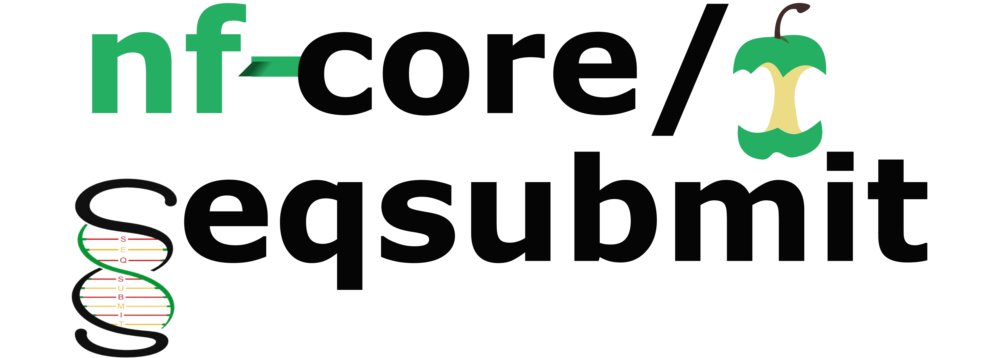
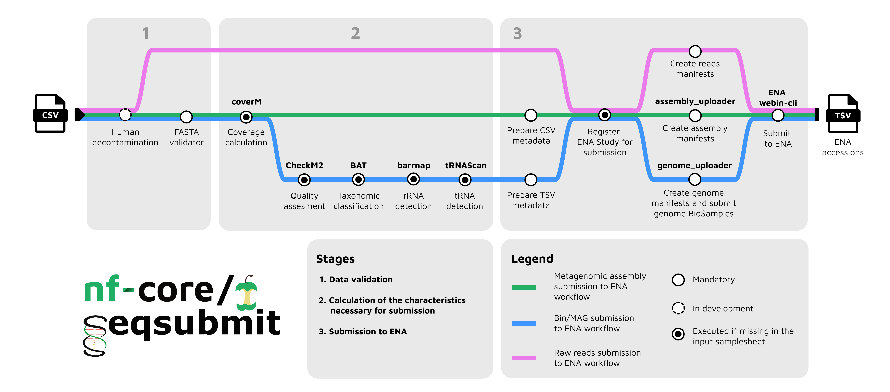

<h1>
  <picture>
    <source media="(prefers-color-scheme: dark)" srcset="docs/images/nf-core-seqsubmit_logo_dark.png">
    
  </picture>
</h1>

[](https://github.com/codespaces/new/nf-core/seqsubmit)
[](https://github.com/nf-core/seqsubmit/actions/workflows/nf-test.yml)
[](https://github.com/nf-core/seqsubmit/actions/workflows/linting.yml)[](https://nf-co.re/seqsubmit/results)[](https://doi.org/10.5281/zenodo.XXXXXXX)
[](https://www.nf-test.com)

[](https://www.nextflow.io/)
[](https://github.com/nf-core/tools/releases/tag/4.0.2)
[](https://docs.conda.io/en/latest/)
[](https://www.docker.com/)
[](https://sylabs.io/docs/)
[](https://cloud.seqera.io/launch?pipeline=https://github.com/nf-core/seqsubmit)

[](https://nfcore.slack.com/channels/seqsubmit)[](https://bsky.app/profile/nf-co.re)[](https://mstdn.science/@nf_core)[](https://www.youtube.com/c/nf-core)

## Introduction



**nf-core/seqsubmit** is a Nextflow pipeline for submitting sequence data to [ENA](https://www.ebi.ac.uk/ena/browser/home).
The pipeline currently supports the following submission modes, each routed to a dedicated workflow:

- `reads` — raw sequencing reads submission via the `READSUBMIT` workflow (<span style="color:pink">pink</span>)
- `metagenomic_assemblies` — assembly submission via the `ASSEMBLYSUBMIT` workflow (<span style="color:green">green</span>)
- `mags` — metagenome-assembled genomes (MAGs) submission via the `GENOMESUBMIT` workflow (<span style="color:blue">blue</span>)
- `bins` — bins submission via the `GENOMESUBMIT` workflow (<span style="color:blue">blue</span>)

<!-- TODO add schema description here -->

Each workflow has its own samplesheet structure, prerequisites, and limitations — they are briefly described below. See the [usage documentation](https://nf-co.re/seqsubmit/usage) for more detailed explanations.

## Requirements

- [Nextflow](https://www.nextflow.io/) `>=25.04.0`
- A Webin account registered at <https://www.ebi.ac.uk/ena/submit/webin/login>

  Set your Webin credentials as Nextflow secrets:

  ```bash
  nextflow secrets set ENA_WEBIN "Webin-XXX"
  nextflow secrets set ENA_WEBIN_PASSWORD "XXX"
  ```

  Make sure to replace the values above with your own credentials.

- Provide either a study accession or a study registration metadata file for the study the submission will be associated with. See the [Submission study](docs/usage.md#submission-study) section of the usage documentation for details.

- Depending on the chosen mode, samples, reads, or metagenomic assemblies must be pre-submitted to ENA to obtain the corresponding accessions, which you then reference in your submission. Refer to the relevant mode section in the [usage documentation](https://nf-co.re/seqsubmit/usage) for details.

## Input samplesheets

### `reads` mode

Example:

```csv
id,sample_accession,fastq_1,fastq_2,platform,instrument,library_source,library_selection,library_strategy,insert_size,library_name,description
illumina_run_001,SAMEA1234567,data/reads_R1.fastq.gz,data/reads_R2.fastq.gz,ILLUMINA,Illumina HiSeq 2000,GENOMIC,RANDOM,WGS,500,HiSeq_library_001,Illumina sequencing of sample XYZ
```

See the [`reads` mode section](docs/usage.md#samplesheet-input) of the usage documentation for more details.

### `metagenomic_assemblies` mode

Example:

```csv
id,fasta,fastq_1,fastq_2,coverage,run_accession,assembler,assembler_version
assembly_1,data/contigs_1.fasta.gz,data/reads_1.fastq.gz,data/reads_2.fastq.gz,,ERR011322,SPAdes,3.15.5
assembly_2,data/contigs_2.fasta.gz,,,42.7,ERR011323,MEGAHIT,1.2.9
```

See the [`metagenomic_assemblies` mode section](docs/usage.md#samplesheet-input-1) of the usage documentation for more details.

### `mags` and `bins` modes

Example:

```csv
id,fasta,accession,fastq_1,fastq_2,assembly_software,binning_software,binning_parameters,stats_generation_software,completeness,contamination,genome_coverage,metagenome,co-assembly,broad_environment,local_environment,environmental_medium,RNA_presence,NCBI_lineage
lachnospira_eligens,data/bin_lachnospira_eligens.fa.gz,SRR24458089,,,spades_v3.15.5,metabat2_v2.6,default,CheckM2_v1.0.1,61.0,0.21,32.07,sediment metagenome,No,marine,cable_bacteria,marine_sediment,No,d__Bacteria;p__Proteobacteria;s__unclassified_Proteobacteria
```

See the [`mags` and `bins` modes section](docs/usage.md#samplesheet-input-2) of the usage documentation for the full list of required and optional columns.

## Usage

> [!NOTE]
> If you are new to Nextflow and nf-core, please refer to [this page](https://nf-co.re/docs/get_started/environment_setup/overview) on how to set-up Nextflow. Make sure to [test your setup](https://nf-co.re/docs/get_started/run-your-first-pipeline) with `-profile test` before running the workflow on actual data.

### Running the pipeline

Each mode also has its own additional parameters and example commands — see the [usage documentation](https://nf-co.re/seqsubmit/usage) for details. General command template:

```bash
nextflow run nf-core/seqsubmit \
    -profile <docker/singularity/...> \
    --mode <mags|bins|metagenomic_assemblies|reads> \
    --input <samplesheet.csv> \
    --centre_name <your_centre> \
    --submission_study <your_study> \
    --outdir <outdir>
```

> [!WARNING]
> Please provide pipeline parameters via the CLI or Nextflow `-params-file` option. Custom config files including those provided by the `-c` Nextflow option can be used to provide any configuration _**except for parameters**_; see [docs](https://nf-co.re/docs/running/run-pipelines#using-parameter-files).

For more details and further functionality, please refer to the [usage documentation](https://nf-co.re/seqsubmit/usage) and the [parameter documentation](https://nf-co.re/seqsubmit/parameters).

## Pipeline output

Key output locations in `--outdir`:

- `reads/`: per-sample submission receipts and accessions
- `metagenomic_assemblies/`: assembly metadata CSVs and per-sample coverage files
- `mags/` or `bins/`: genome metadata, manifests, and per-sample submission support files
- `multiqc/`: MultiQC summary report
- `pipeline_info/`: execution reports, trace, DAG, and software versions

For full details, see the [output documentation](https://nf-co.re/seqsubmit/output).

## Credits

nf-core/seqsubmit was originally written by [Martin Beracochea](https://github.com/mberacochea), [Ekaterina Sakharova](https://github.com/KateSakharova), [Sofia Ochkalova](https://github.com/ochkalova), [Evangelos Karatzas](https://github.com/vagkaratzas) and [Tim Rozday](https://github.com/timrozday-mgnify).

## Contributions and Support

If you would like to contribute to this pipeline, please see the [contributing guidelines](docs/CONTRIBUTING.md).

For further information or help, don't hesitate to get in touch on the [Slack `#seqsubmit` channel](https://nfcore.slack.com/channels/seqsubmit) (you can join with [this invite](https://nf-co.re/join/slack)).

## Citations

<!-- TODO nf-core: Add citation for pipeline after first release. Uncomment lines below and update Zenodo doi and badge at the top of this file. -->

<!-- If you use nf-core/seqsubmit for your analysis, please cite it using the following doi: [10.5281/zenodo.XXXXXX](https://doi.org/10.5281/zenodo.XXXXXX) -->

If you use this pipeline please make sure to cite all used software.
This pipeline uses code and infrastructure developed and maintained by the [nf-core](https://nf-co.re) community, reused here under the [MIT license](https://github.com/nf-core/tools/blob/main/LICENSE).

> **MGnify: the microbiome sequence data analysis resource in 2023**
>
> Richardson L, Allen B, Baldi G, Beracochea M, Bileschi ML, Burdett T, et al.
>
> Vol. 51, Nucleic Acids Research. Oxford University Press (OUP); 2022. p. D753–9. Available from: http://dx.doi.org/10.1093/nar/gkac1080

An extensive list of references for the tools used by the pipeline can be found in the [`CITATIONS.md`](CITATIONS.md) file.

You can cite the `nf-core` publication as follows:

> **The nf-core framework for community-curated bioinformatics pipelines.**
>
> Philip Ewels, Alexander Peltzer, Sven Fillinger, Harshil Patel, Johannes Alneberg, Andreas Wilm, Maxime Ulysse Garcia, Paolo Di Tommaso & Sven Nahnsen.
>
> _Nat Biotechnol._ 2020 Feb 13. doi: [10.1038/s41587-020-0439-x](https://dx.doi.org/10.1038/s41587-020-0439-x).
